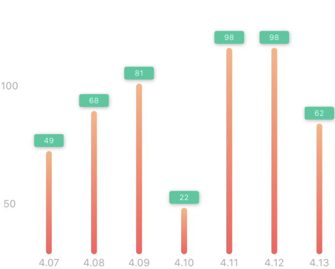

# TKChartView

[](http://cocoapods.org/pods/TKChartView)
[](http://cocoapods.org/pods/TKChartView)
[]()
[](https://www.apple.com/nl/ios/)
[](http://cocoapods.org/pods/TKChartView)

TKChartView is a simple and customizable bar chart



## Installation

#### CocoaPods
You can use [CocoaPods](http://cocoapods.org/) to install `TKChartView` by adding it to your `Podfile`:

```ruby
platform :ios, '10.0'
use_frameworks!
pod 'TKChartView'
```

To get the full benefits import `TKChartView`

``` swift
import TKChartView
```

#### Manually
1. Download and drop ```Source/BarChart``` in your project.  
2. Congratulations!  

## Usage example

#### BarChartView

``` swift
let barView = TKBarChartView()
let barModels = [TKBarChartModel(topText: "10", bottomText: "4.1", heightRadio: 0.5)
    ,TKBarChartModel(topText: "20", bottomText: "4.2", heightRadio: 1.0),
     TKBarChartModel(topText: "10", bottomText: "4.1", heightRadio: 0.1)
]
barView.updateDatas(barModels: barModels)
```

## Contribution

You are welcome to contribute to the project by forking the repo, modifying the code and opening issues or pull requests.

## License

Available under MIT license. See the [LICENSE](https://github.com/caanvu/TKChartView/blob/master/LICENSE) for more info.
